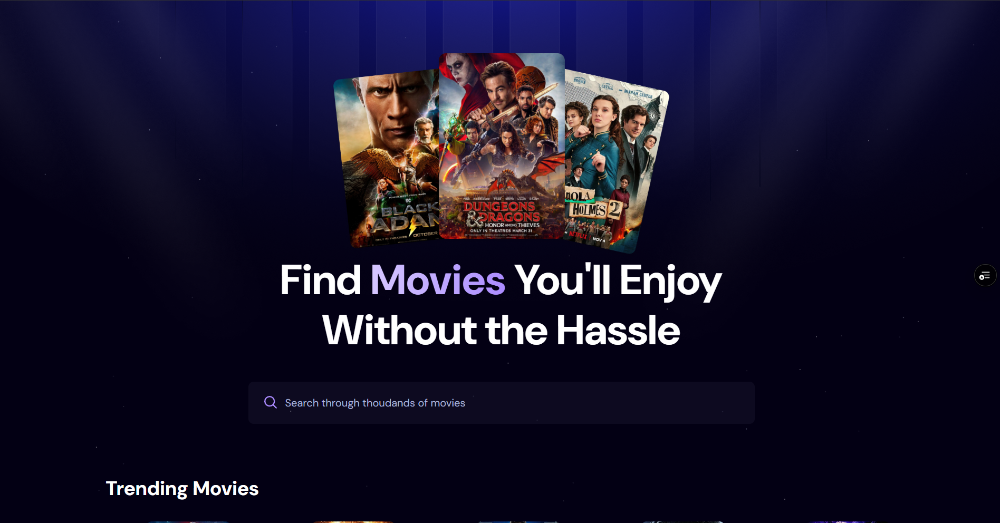
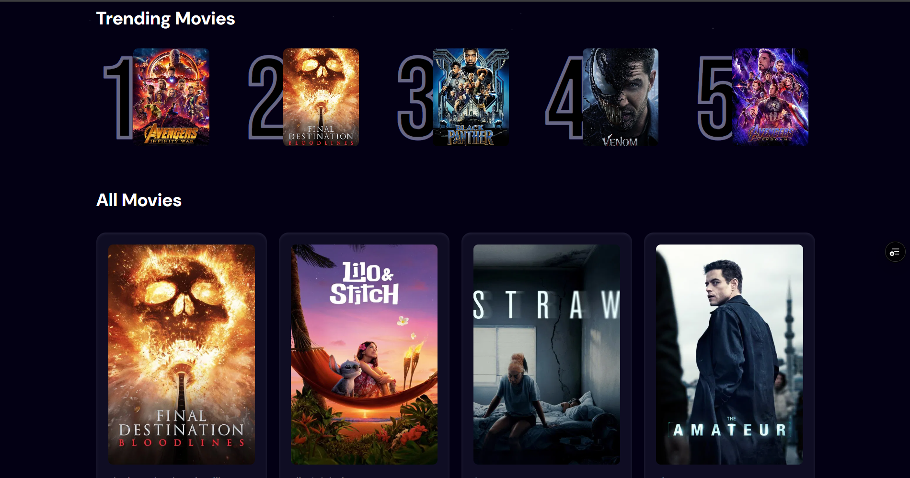

## 🚀 Getting Started 😀

# 🎬 Trending Movie Tracker

A modern movie search and tracking web app built with **React + Vite**, using **TMDB API** for movie data and **Appwrite** as the backend to store trending searches.

---

## 🔍 Features

- 🔥 Search for movies using the TMDB API
- 📈 Track search frequency and store it in Appwrite
- 🌐 Deployed on Vercel with environment variables
- ⚡ Built using React, Tailwind CSS, and Vite

---

## 🧰 Tech Stack

- [React](https://reactjs.org/)
- [Vite](https://vitejs.dev/)
- [Tailwind CSS](https://tailwindcss.com/)
- [TMDB API](https://www.themoviedb.org/documentation/api)
- [Appwrite (Cloud)](https://cloud.appwrite.io/)
- [Vercel](https://vercel.com/)

---

## 📸 Screenshots

### 🔍 Search Results Page

### 🔢 Trending Movie List

---

